# R95 Fonts

[](https://stackblitz.com/~/github.com/React95/R95-Sans-serif)

MS Serif and MS Sans Serif from Windows 95, converted to TTF and WOFF2 for modern web use.
Two typefaces, two display resolutions, six point sizes each.

| Variant | Family name pattern | Source |
| ------- | ------------------- | ------ |
| MS Sans Serif — 96 dpi (VGA) | `R95 Sans Serif Xpt` | `SSERIFE.FON` |
| MS Sans Serif — 120 dpi (HiRes) | `R95 Sans Serif HiRes Xpt` | `SSERIFF.FON` |
| MS Serif — 96 dpi (VGA) | `R95 Serif Xpt` | `SERIFE.FON` |
| MS Serif — 120 dpi (HiRes) | `R95 Serif HiRes Xpt` | `SERIFF.FON` |

Available sizes: **8, 10, 12, 14, 18, 24 pt**.

## Previews

### MS Sans Serif — 96 dpi (VGA)

| Size | Preview |
| ---- | ------- |
| 8pt  | 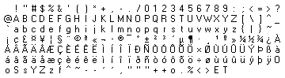 |
| 10pt | 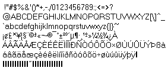 |
| 12pt | 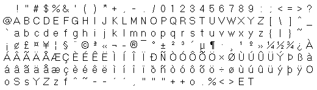 |
| 14pt | 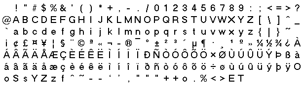 |
| 18pt | 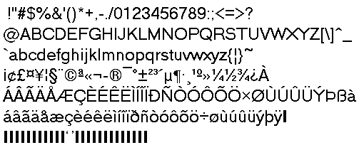 |
| 24pt | 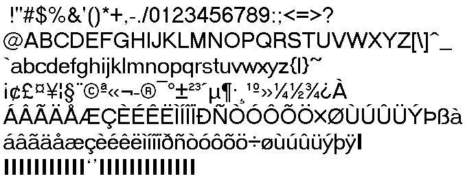 |

### MS Sans Serif — 120 dpi (HiRes)

| Size | Preview |
| ---- | ------- |
| 8pt  | 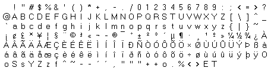 |
| 10pt | 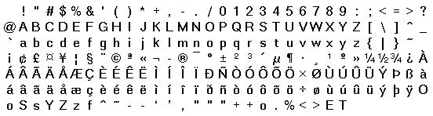 |
| 12pt | 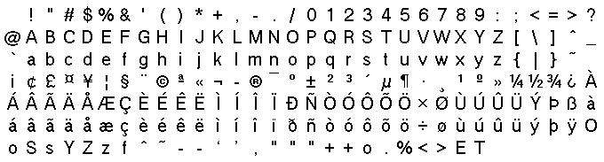 |
| 14pt |  |
| 18pt | 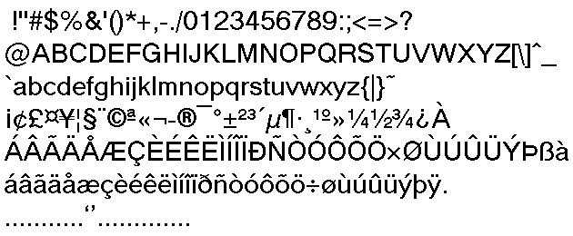 |
| 24pt | 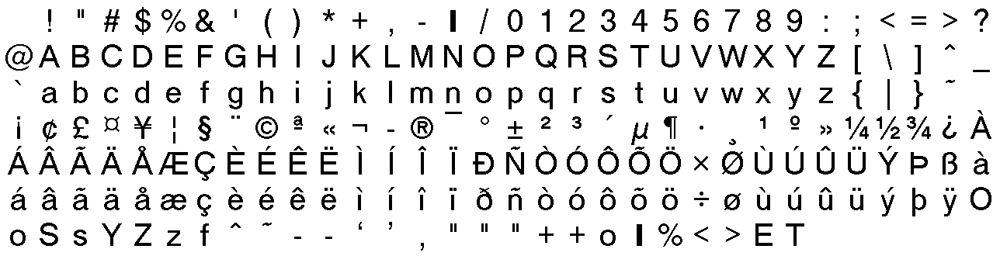 |

### MS Serif — 96 dpi (VGA)

| Size | Preview |
| ---- | ------- |
| 8pt  | 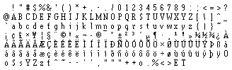 |
| 10pt | 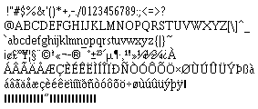 |
| 12pt |  |
| 14pt | 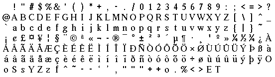 |
| 18pt |  |
| 24pt | 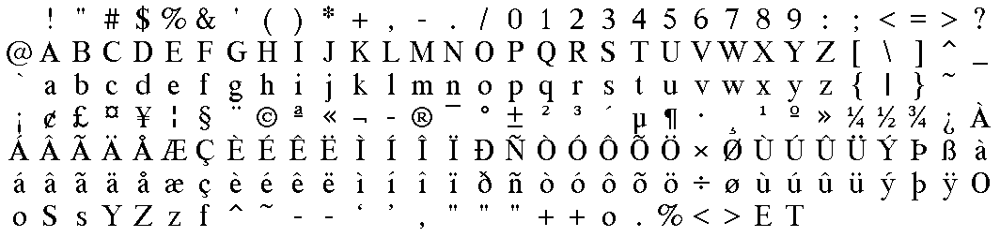 |

### MS Serif — 120 dpi (HiRes)

| Size | Preview |
| ---- | ------- |
| 8pt  |  |
| 10pt | 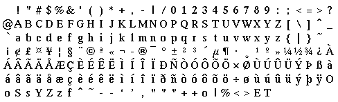 |
| 12pt | 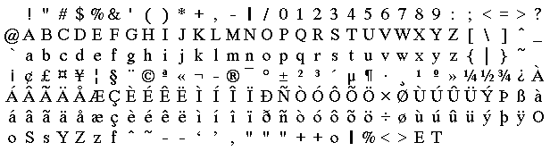 |
| 14pt | 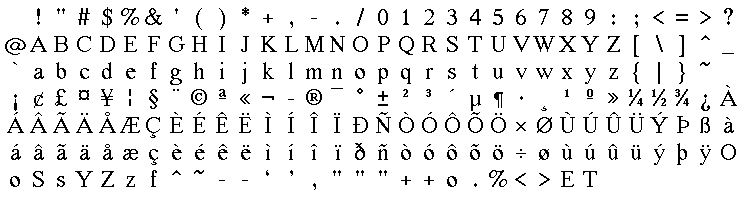 |
| 18pt | 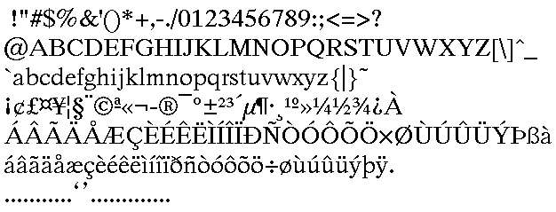 |
| 24pt | 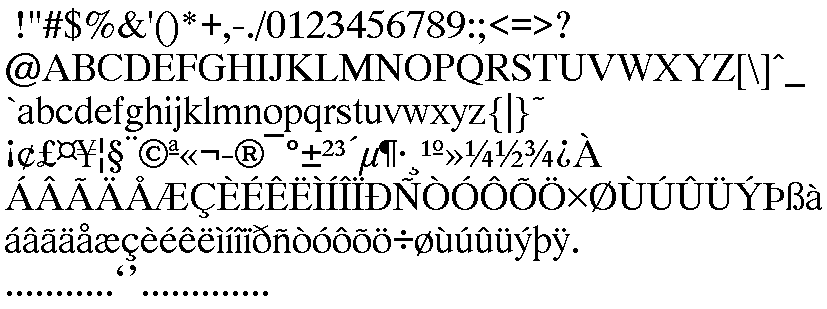 |

## Installation

```bash
npm install @react95/fonts
```

## Usage

### Importing

Choose as much or as little as you need:

```js
// Everything — all 4 variants, all 6 sizes
import '@react95/fonts'

// One full variant (all 6 sizes)
import '@react95/fonts/sans-serif'        // MS Sans Serif 96 dpi  ← classic Win95 UI
import '@react95/fonts/sans-serif-hires'  // MS Sans Serif 120 dpi
import '@react95/fonts/serif'             // MS Serif 96 dpi
import '@react95/fonts/serif-hires'       // MS Serif 120 dpi

// One size from one variant
import '@react95/fonts/sans-serif/14pt'
import '@react95/fonts/serif/8pt'
import '@react95/fonts/sans-serif-hires/24pt'
```

### CSS

Each import registers one or more `@font-face` rules. Reference the family by name:

```css
body {
  font-family: 'R95 Sans Serif 14pt';
  font-size: 14px; /* see note below */
}
```

> **Pixel-perfect rendering** — these are bitmap fonts, so each size has a
> fixed native pixel height. Set `font-size` to that height for a 1:1 rendering.
>
> |           Import         |         Family name         | Native height |
> |--------------------------|-----------------------------|---------------|
> | `/sans-serif/8pt`        | `R95 Sans Serif 8pt`        |     13 px     |
> | `/sans-serif/10pt`       | `R95 Sans Serif 10pt`       |     16 px     |
> | `/sans-serif/12pt`       | `R95 Sans Serif 12pt`       |     20 px     |
> | `/sans-serif/14pt`       | `R95 Sans Serif 14pt`       |     24 px     |
> | `/sans-serif/18pt`       | `R95 Sans Serif 18pt`       |     29 px     |
> | `/sans-serif/24pt`       | `R95 Sans Serif 24pt`       |     37 px     |
> | `/sans-serif-hires/8pt`  | `R95 Sans Serif HiRes 8pt`  |     16 px     |
> | `/sans-serif-hires/10pt` | `R95 Sans Serif HiRes 10pt` |     20 px     |
> | `/sans-serif-hires/12pt` | `R95 Sans Serif HiRes 12pt` |     25 px     |
> | `/sans-serif-hires/14pt` | `R95 Sans Serif HiRes 14pt` |     29 px     |
> | `/sans-serif-hires/18pt` | `R95 Sans Serif HiRes 18pt` |     36 px     |
> | `/sans-serif-hires/24pt` | `R95 Sans Serif HiRes 24pt` |     46 px     |
> | `/serif/8pt`             | `R95 Serif 8pt`             |     13 px     |
> | `/serif/10pt`            | `R95 Serif 10pt`            |     16 px     |
> | `/serif/12pt`            | `R95 Serif 12pt`            |     19 px     |
> | `/serif/14pt`            | `R95 Serif 14pt`            |     21 px     |
> | `/serif/18pt`            | `R95 Serif 18pt`            |     27 px     |
> | `/serif/24pt`            | `R95 Serif 24pt`            |     35 px     |
> | `/serif-hires/8pt`       | `R95 Serif HiRes 8pt`       |     16 px     |
> | `/serif-hires/10pt`      | `R95 Serif HiRes 10pt`      |     20 px     |
> | `/serif-hires/12pt`      | `R95 Serif HiRes 12pt`      |     23 px     |
> | `/serif-hires/14pt`      | `R95 Serif HiRes 14pt`      |     27 px     |
> | `/serif-hires/18pt`      | `R95 Serif HiRes 18pt`      |     33 px     |
> | `/serif-hires/24pt`      | `R95 Serif HiRes 24pt`      |     43 px     |

## Contributing

### Repository layout

```
sources/
  SERIFE.FON            ← MS Serif 96 dpi (VGA)
  SERIFF.FON            ← MS Serif 120 dpi (HiRes)
  SSERIFE.FON           ← MS Sans Serif 96 dpi (VGA)
  SSERIFF.FON           ← MS Sans Serif 120 dpi (HiRes)
  serif/
    96dpi/  8pt/ 10pt/ 12pt/ 14pt/ 18pt/ 24pt/   ← generated
    120dpi/ 8pt/ 10pt/ 12pt/ 14pt/ 18pt/ 24pt/   ← generated
  sans-serif/
    96dpi/  8pt/ 10pt/ 12pt/ 14pt/ 18pt/ 24pt/   ← generated
    120dpi/ 8pt/ 10pt/ 12pt/ 14pt/ 18pt/ 24pt/   ← generated
  previews/
    sans-serif/       8pt.png … 24pt.png          ← generated
    sans-serif-hires/ 8pt.png … 24pt.png          ← generated
    serif/            8pt.png … 24pt.png          ← generated
    serif-hires/      8pt.png … 24pt.png          ← generated
scripts/
  fnt2ttf.py            ← conversion pipeline (FON → TTF + WOFF2 + CSS)
  preview.py            ← glyph-sheet PNG generator
*.css                   ← generated — do not edit by hand
```

### Setting up locally

**Prerequisites:** Python 3.9+, Node.js, pnpm.

```bash
# 1. Clone and install JS dependencies
git clone https://github.com/React95/R95-Sans-serif
cd R95-Sans-serif
pnpm install

# 2. Install Python conversion dependencies
pip install monobit fonttools brotli pillow

# 3. Start the demo app
pnpm dev
```

### Regenerating the fonts

```bash
python3 scripts/fnt2ttf.py
```

The script reads each `.FON` file listed in `FON_SPECS`, converts every embedded
bitmap font to TTF and WOFF2, and writes all CSS files automatically. It also
prints a ready-to-paste `exports` block for `package.json` at the end.

### Regenerating the preview images

```bash
python3 scripts/preview.py
```

Reads the same `.FON` files directly and renders a glyph sheet (all printable
characters) for each size into `sources/previews/`.

### Adding a new FON file

1. Drop the `.FON` file into `sources/`.
2. Add an entry to `FON_SPECS` in `scripts/fnt2ttf.py`:
   ```python
   ("MYNEWFONT.FON", "sans-serif", 96),   # family, dpi
   ```
3. Run `python3 scripts/fnt2ttf.py`.
4. Copy the printed `exports` block into `package.json`.
5. Update the usage table in this README.

### Running the demo app

```bash
pnpm dev      # development server with hot reload
pnpm build    # production build
pnpm preview  # preview the production build
```

## License

The original bitmap data is Copyright Microsoft Corp. 1987. All rights reserved.
The conversion tooling in this repository is released under the MIT License.
